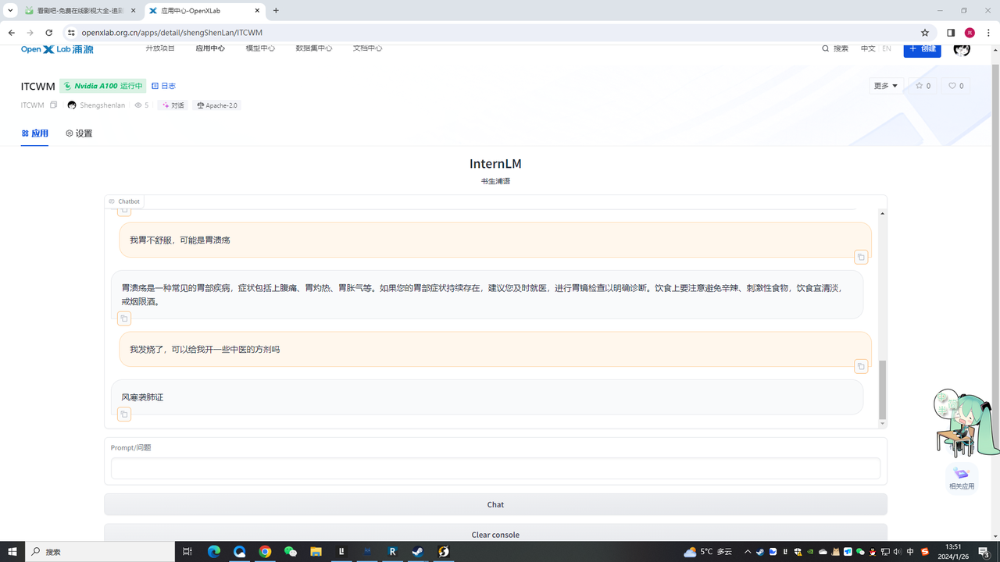

# （ITCWM)中西医结合诊疗方案大模型


<div align="center">
      </div>

## 🌐项目简介

本项目使用中医诊疗的数据进行微调，将西医的诊疗数据以外挂知识库加入，训练一个以中医为主西医为辅的提供诊疗方案的语言模型。目前模型的主要功能如下：

<!DOCTYPE html>
<html>
<body>
<table style="width: 100%;">
  <tr style="border-collapse: collapse; border: transparent;">
      <td style="width: 50%; border-collapse: collapse;border: transparent;"></td>
      <td style="width: 50%; border-collapse: collapse;border: transparent;"></td>
  </tr>
  <tr style="border-collapse: collapse; border: transparent;">
      <td style="width: 50%; border-collapse: collapse;border: transparent;" ><div align="center"><strong>医疗问答</strong>：对医疗问题进行解答，对案例进行分析。</div></td>
      <td style="width: 50%; border-collapse: collapse;border: transparent;"><div align="center"><strong>智能问诊</strong>：多轮问诊后给出诊断结果和建议。</div></td>
  </tr>
</table>
</body>
</html>


##  🔬模型参数

<!DOCTYPE html>
<html>
<head>
</head>
<body>
<table style="width: 70%;">
  <tr>
      <td style="width: 20%;"><div align="center"><strong>基座模型</strong></div></td>
      <td style="width: 20%;"><div align="center"><strong>微调后的权重</strong></div></td>
      <td style="width: 20%;"><div align="center"><strong>词向量模型</strong></div></td>
      <td style="width: 30%;"><div align="center"><strong>项目权重地址</strong></div></td>
  </tr>
  <tr>
      <td><center> <a href="https://openxlab.org.cn/models/detail/OpenLMLab/InternLM-chat-7b"> InternLM-chat-7b</a></center></td>
      <td><center> <a href="https://www.modelscope.cn/models/Shengshenlan/ITCWM/files"> merged</a></center></td>
      <td><center> <a href="https://huggingface.co/BAAI/bge-large-zht"> bge-large-zh</a></center></td>
      <td><center> <a href="https://www.modelscope.cn/models/Shengshenlan/ITCWM/summary">modelscope</a></center></td>
  </tr>
</table>
</body>
</html>

## To do

- [x] 实现V1.0-ITCWM的训练及部署，即模型可以给出基本的诊疗结果。

- [ ] 探索更多元的 ITCWM
    - [ ] 使用多种微调方法对 InternLM2 训练微调，找到最适合聊天机器人的微调方法。
    - [ ] 寻找微调的最优参数

- [ ] 实现V2.0-ITCWM的训练及部署，可以通过图片和文本阅读，给出诊疗信息。


## ⚡快速开始

1. 配置环境（测试环境如下，具体版本可以根据实际需求配置）

   * python==3.10.16
   * pytorch==1.13.0+cu116

2. 安装项目依赖 

   ```bash
   git https://github.com/Shengshenlan/ITCWM-exe
   cd Shengshenlan
   pip install -e .
   ```


## 🗃️数据集构建

西医诊疗数据来源于[丁香医生疾病百科](https://dxy.com/diseases), 通过网络爬虫获取各疾病的详细介绍，每条数据的格式如下：

```JSON
{
    "id": "7", // ID
    "name": "大叶性肺炎", // 疾病名称
    // 疾病介绍 
    "intro": "大叶性肺炎(lobarpneumonia)，又名肺炎球菌肺炎，是由肺炎双球菌等细菌感染引起的呈大叶性分布的急性肺实质炎症。好发于青壮年男性和冬春季节，常见诱因有受凉、淋雨、醉酒或全身麻醉手术后、镇静剂过量等，当这些诱因使呼吸道防御功能被削弱时，细菌侵入肺泡通过变态反应使肺泡壁毛细血管通透性增强，浆液及纤维素渗出，富含蛋白的渗出物中细菌迅速繁殖，并向邻近肺组织蔓延，波及一个肺段或整个肺叶。近年来由于大量强有力抗生素的使用，典型的大叶性肺炎已较少见到。临床症状有突然寒战、高热、胸痛、咳嗽、咳铁锈色痰，部分患者有恶心、呕吐及烦躁不安、谵妄等消化系统和神经系统症状。体征有急性病容，呼吸急促，鼻翼扇动，早期肺部体征不明显或仅有呼吸音减低和胸膜摩擦音;实变期可有典型体征，如患侧呼吸运动减弱，语颤增强，叩诊浊音，听诊呼吸音减低，有湿罗音或病理性支气管呼吸音。血白细胞计数及中性粒细胞增高;典型的X线表现为肺段、叶实变。该病病程短，及时应用青霉素等抗生素治疗可痊愈。", 
    "insurance": "否",  // 是否加入医疗保险
    "get_prob": "0.4%", // 患病概率
    "cure_dept": "内科呼吸内科", // 治疗科室
    "easy_get": "多发生于青壮年男性", // 多发人群
    "get_way": "无传染性",  // 传播途径
    "neopathy": ["中毒性休克综合征", "败血症", "肺脓肿", "脓胸"], // 并发症
    "drug": ["乳酸左氧氟沙星片", "阿奇霉素片"], //治疗药物
    "treat": "青霉素等抗生素药物治疗 对症支持性治疗 并发症治疗", // 疗法
    "treat_prob": "90%以上 ",  // 疗愈率
    "treat_period": "7--10天", // 疗程
    "treat_cost": "根据不同医院，收费标准不一致，省市三甲医院约（3000-8000元）", // 治疗费用
    // 病因
    "cause": "多种细菌均可引起大叶性肺炎，但绝大多数为肺炎链球菌。肺炎链球菌为革兰阳性球菌，有荚膜，其致病力是由于高分子多糖体的荚膜对组织的侵袭作用。少数为肺炎杆菌、金黄色葡萄球菌、溶血性链球菌、流感嗜血杆菌等。\n当机体受寒、过度疲劳、醉酒、感冒、糖尿病、免疫功能低下等使呼吸道防御功能被削弱，细菌侵入肺泡通过变态反应使肺泡壁毛细血管通透性增强，浆液及纤维素渗出，富含蛋白的渗出物中细菌迅速繁殖，并通过肺泡间孔或呼吸细支气管向邻近肺组织蔓延，波及一个肺段或整个肺叶。大叶间的蔓延系带菌的渗出液经叶支气管播散所致。\n大叶肺炎病变起始于局部肺泡，并迅速蔓延至一个肺段或整个大叶。临床上起病急骤，病程大约一周。常以高热、恶寒开始，继而出现胸痛、咳嗽、咳铁锈色痰、呼吸困难、并有肺实变体征及外周血白细胞计数增高等。", 
    // 预防方法
    "prevent": "大叶性肺炎预防\n1、注意预防上呼吸道感染，加强耐寒锻炼。\n2、避免淋雨受寒，醉酒，过劳等诱因。\n3、积极治疗原发病，如慢性心肺疾病，慢性肝炎，糖尿病和口腔疾病等，可以预防大叶性肺炎。", "symptom": ["发烧", "高热", "胸痛", "咳铁锈色痰", "湿啰音", "急性面容", "呼吸音减弱"], 
    // 详细疗法
    "treat_detail": "大叶性肺炎西医治疗\n治疗原则\n（1）、加强护理和支持疗法。\n（2）、抗菌药物治疗。\n（3）、休克型肺炎的治疗：加强护理，严密监测。补充血容量纠正休克。纠正酸碱失衡。应用血管活性药物。应用足量抗生素。尽早加用糖皮质激素。防治心、肾功能不全及呼吸衰竭。\n1、抗菌素治疗\n青霉素、磺胺类药、红霉素、洁古霉素、先锋霉素IV号。\n2、对症治疗\n(1)高热者：一般不使用阿司匹林、扑热息痛等退烧药，避免因严重脱水引起低血容量性休克。\n(2)疼痛及严重烦躁不安者：可予以水合氯醛镇静治疗者亦不使用可卡因、安定等抑制呼吸类药物。\n(3)咳嗽咳痰者：氯化铵合剂。\n(4)保持水电解质平衡。\n(5)休克呼吸衰竭：作相应处理。\n(6)颅内高压者：使用利尿剂。\n3、应急处理\n(1)卧床休息，给予高热量、多维生素及易消化食物饮食，鼓励病人多喝水或菜汤以补充水分。\n(2)全身应用大剂量抗生素如青霉素、氨苄青霉素等。\n(3)高热者可在头、腋下、NF窝等处放置冰袋或冷水袋，全身温水或酒精擦浴等物理降温处理，必要时口服解热药物如APC、消炎痛等。\n(4)神志恍惚或昏迷者，及时清除口腔内异物，保持呼吸道通畅。\n(5)休克者应平卧，头稍低，并速送医院抢救。\n大叶性肺炎中医治疗\n1、邪犯肺卫\n【治则】辛凉解表，宣肺止咳\n【方药】用银翘散加减：银花、连翘、大青叶、薄荷、前胡、桔梗、杏仁、桑白皮、玄参、芒根\n2、痰热壅肺\n【治则】清热解毒，宣肺化痰\n【方药】用麻杏石甘汤合苇茎汤加减：麻黄、杏仁、生石膏、鱼腥草、虎杖、蒲公英、黄芩、冬瓜仁、桃仁、生薏仁、芦根、甘草\n3、热入营血\n【治则】清营透热，清心开窍，凉肝熄风\n【方药】用清营汤加减：水牛角、黄连、生地、玄参、麦冬、银花、连翘、鱼腥草、丹皮、菖蒲、白芍、甘草、神昏加服安宫牛黄丸、抽搐加羚羊角、全蝎\n4、正气虚脱\n【治则】益气固脱，回阳救逆\n【方药】用参附汤合生脉散加味：人参、熟附子、肉桂、麦冬、五味子、龙骨、牡蛎\n5、温邪伤阴\n【治则】益气养阴，清肺化痰\n【方药】用竹叶石膏汤加减：竹叶、石膏、麦冬、太子参、桑白皮、地骨皮、石斛、贝母、瓜萎\n(以上资料仅供参考，详细请询问医生。)", "nursing": "1、环境的调整：保持病室环境舒适，空气流通，适宜的温湿度。尽量使患者安静，以减少氧气的需要量。按医嘱使用抗生素治疗，并观察治疗效果。\n2、保持呼吸道通畅：密切监测生命体征和呼吸窘迫程度以帮助了解疾病的发展情况；帮助患者取合适体位，抬高床头30°～60°，以利于呼吸运动和上呼吸道分泌物排出，鼓励患者患侧卧位以减轻疼痛及减少咳嗽；帮助清除呼吸道分泌物。\n3、发热的护理：高热时，首先给予物理降温，可用水袋冷敷前额或用50%的温水酒精擦拭腋下、腹股沟、胭窝等大血管行走处，每次擦拭29min左右，待半小时后测试体温并记录于体温记录单上。酒精擦浴时应用温度为37℃的酒精，稍用力至局部皮肤潮红，同时要注意遮盖病人，以免受凉。效果不佳时，可改药物降温，用药剂量不宜过大，以免因出汗过多体温骤降引起虚脱。高热时由于神经系统兴奋性增强，病人可能出现烦躁不安、谵语和惊厥，应加强防护措施，并给予适当的镇静剂。由于高热唾液分泌减少，口唇干裂，容易发生口腔炎，应用生理盐水或多贝尔液漱口，保持口腔清洁湿润。\n4、营养及水分的补充：鼓励患者进高热量、高蛋白饮食，并要多饮水。蛋白质和热量不足会影响疾病的恢复，摄入足够的水分可保证呼吸道黏膜的湿润与黏膜病变的修复，并增加纤毛运动能力。", 
    "can_eat": ["栗子（熟）", "鲫鱼", "猪肉(瘦)", "油菜"],  // 宜食
    "not_eat": ["洋葱", "辣椒(青、尖)", "辣椒(红、尖、干)", "韭菜"] // 忌食
}
```

其中，`id` , `name`和`intro`在每组数据均出现，其余的键并非所有数据都有。

最终收集到6197条相关数据。


### 模型训练与微调

微调后的模型上传到modelscope：https://www.modelscope.cn/Shengshenlan/ITCWM.git


### 构建知识库

- 使用工具

1. Python 3.10：数据处理
2. LangChain：向量数据库构建

- 数据来源

这个知识库基于上文收集的西医诊疗数据。

- 数据处理

我们对收集到的数据进行如下处理

1. 数据清洗，分块

为在保证查询精度的同时提高查询速度，我们对收集到的数据进行了清洗，仅保留了每条数据的`intro`部分。同时，我们还将收集到的数据分为若干小文件，以加快文档加载工作。

1. 构建向量数据库

构建向量数据库主要有3个步骤:

1）加载文档

 此次收集到的数据为JSON格式，因此我们使用LangChain提供的 `JSONLoader`作为文档加载器，由于`JSONLoader` 使用`jq`作为后端，`jq`会使用`jq schema`筛选数据，因此我们选择在加载数据的同时完成数据清洗。加载数据代码如下

```Python
# 获取文件路径函数
def get_files(dir_path):
    # args：dir_path，目标文件夹路径
    file_list = []
    for filepath, dirnames, filenames in os.walk(dir_path):
        # os.walk 函数将递归遍历指定文件夹
        for filename in filenames:
            file_list.append(os.path.join(filepath, filename))
    return file_list


# 加载文件函数
def get_text(dir_path):
    # args：dir_path，目标文件夹路径
    # # 首先调用上文定义的函数得到目标文件路径列表
    file_lst = get_files(dir_path)
    # docs 存放加载之后的纯文本对象
    docs = []

    # 遍历所有目标文件
    for one_file in tqdm(file_lst):
        loader = JSONLoader(one_file, jq_schema='.data[].intro')  # pip install jq
        docs.extend(loader.load())
    return docs

# 目标文件夹
tar_dir = './data'

# 加载目标文件
docs = []
docs.extend(get_text(tar_dir))
```

2）文本分块

为了提升查询准确性，我们采用了基于BPE的`TokenTextSplitter`对加载的数据进行分块，代码如下

```Python
text_splitter = TokenTextSplitter(chunk_size=700, chunk_overlap=200)
split_docs = text_splitter.split_documents(docs)
```

3）文本向量化及数据库持久化

我们采用[bge-large-zh](https://huggingface.co/BAAI/bge-large-zh)作为预训练词向量模型对分块数据进行向量化，并使用Chroma构建向量数据库，最终将数据库持久化到磁盘，相关代码如下

```Python
# 加载开源词向量模型
embeddings = HuggingFaceEmbeddings(model_name="/root/data/model/bge-large-zh")

# 构建向量数据库
# 定义持久化路径
persist_directory = 'data_base_small/vector_db/chroma'
# 加载数据库
vectordb = Chroma.from_documents(
    documents=split_docs,
    embedding=embeddings,
    persist_directory=persist_directory  # 允许我们将persist_directory目录保存到磁盘上
)
# 将加载的向量数据库持久化到磁盘上
vectordb.persist()
```

### 微调后的模型与知识库相结合

参考https://github.com/InternLM/tutorial/tree/main/langchain

这里只需要把原有的模型地址，换成微调后模型的地址即可（模型最好是hf格式）

### 模型部署

1.部署准备

因为是在openxlab部署，所以需要在github有一个执行代码库：

https://github.com/Shengshenlan/ITCWM-exe

文件结构如图

```Bash
|-- demo
|   |-- LLM.py       
|   |-- create_db.py 
|   |-- run_gradio.py
|-- requirements.txt 
```

2.代码修改

`demo`里面文件内容，同课程教程，唯一要修改的是`run_gradio.py`里的内容。

`requirements.txt`是一个文件，它包含了一组要在项目中使用的Python库的名称。

接下展示`run_gradio.py`修改的部分，主要是开头的内容。

```Python
# 导入必要的库
import gradio as gr
from langchain.vectorstores import Chroma
from langchain.embeddings.huggingface import HuggingFaceEmbeddings
import os
from LLM import InternLM_LLM
from langchain.prompts import PromptTemplate

# 添加 pysqlite3库 的路径 这样LangChain才能正常运行
__import__('pysqlite3')
import sys
sys.modules['sqlite3'] = sys.modules.pop('pysqlite3')

def load_chain():
    # 下载模型
    if not os.path.exists('ITCWM'):
        from modelscope import snapshot_download
        model_dir = snapshot_download('Shengshenlan/ITCWM', cache_dir='./')
    
    # 加载问答链
    # 定义 Embeddings
    # 以下都需要主要模型的地址
    embeddings = HuggingFaceEmbeddings(model_name="Shengshenlan/ITCWM/model/bge-large-zh")

    # 向量数据库持久化路径
    persist_directory = 'Shengshenlan/ITCWM/data_base_small/vector_db/chroma'

    # 加载数据库
    vectordb = Chroma(
        persist_directory=persist_directory,  # 允许我们将persist_directory目录保存到磁盘上
        embedding_function=embeddings
    )

    llm = InternLM_LLM(model_path = "Shengshenlan/ITCWM/model/internlm2-merged")

    template = """使用以下上下文来回答最后的问题。如果你不知道答案，就说你不知道，不要试图编造答
    案。尽量使答案简明扼要。总是在回答的最后说“谢谢你的提问！”。
    {context}
    问题: {question}
    有用的回答:"""

    QA_CHAIN_PROMPT = PromptTemplate(input_variables=["context","question"],
                                    template=template)

    # 运行 chain
    from langchain.chains import RetrievalQA

    qa_chain = RetrievalQA.from_chain_type(llm,
                                        retriever=vectordb.as_retriever(),
                                        return_source_documents=True,
                                        chain_type_kwargs={"prompt":QA_CHAIN_PROMPT})
    
    return qa_chain
```


## 🧭运行结果


项目地址：https://openxlab.org.cn/apps/detail/shengShenLan/ITCWM

项目效果图：




## 引用

如果你使用了本项目的数据或者代码，请声明引用

```latex
@misc{ITCWM,
  author={},
  title = {中西医结合诊疗方案大模型},
  year = {2024},
  publisher = {GitHub},
  journal = {GitHub repository},
  howpublished = {\url{https://github.com/}},
}
```

## 致谢

<div align="center">

***感谢上海人工智能实验室组织的 书生·浦语实战营 学习活动~***

***感谢 OpenXLab 对项目部署的算力支持~***

***感谢 浦语小助手 对项目的支持~***
</div>

